# Karna Cortex Vision: Execution Flow Visualization

> ⚠️ Note: This system implements biomimetic, vision-driven automation **inspired** by human visual perception. It does not claim to replicate biological cognition or full neural complexity.

This document visualizes the execution flow and component interaction of the Karna Cortex Vision module, which implements biomimetic, vision-driven automation inspired by human visual perception for UI automation.


## System Architecture Overview

The Karna Cortex Vision system is conceptualised as a biomimetic architecture that mirrors the human visual cortex, with hierarchical processing layers that transform raw visual input into structured perception and goal-directed actions.

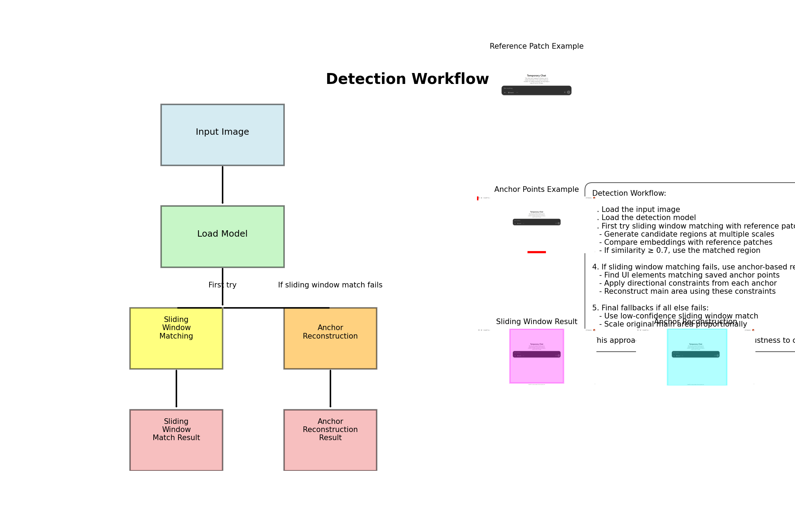

## Neuroscience-Inspired Hierarchical Processing

The system's architecture maps to the biological visual cortex, with specialized components for each level of processing:

```
Visual Cortex Hierarchy and System Mapping
------------------------------------------

1. Primary Visual Processing (V1/V2)
   - Omniparser: OCR Engine, YOLO Models, ResNet Embeddings

2. Visual Feature Detection (V2/V3)
   - Image Comparison
   - Content Detection
   - Pattern Matching

3. Pattern Recognition (V4/IT)
   - Vertical Patch Matcher
   - Anchor-based Detection

4. Motion Processing (MT/V5)
   - Dynamic Area Detection
   - Image Diff Creator
   - UI Dynamic Detection

5. Spatial Attention (Parietal)
   - Attention Controller
   - Extended Attention

6. Object Categorization (Inferotemporal)
   - Clustering
   - Omni Helper

7. Working Memory (Prefrontal)
   - Task Schema
   - Task Generator

8. Executive Planning (Frontal)
   - Task Planning
   - Task Planner

9. Action Execution (Motor Cortex)
   - Task Executor
   - Clipboard Utils

10. Multimodal Integration (Association Areas)
    - System Integration
    - Task Structures
```

## Visual Processing Components

### Attention Fields

The Attention Controller simulates human-like gaze focus, directing computational resources to the most relevant areas of the screen.

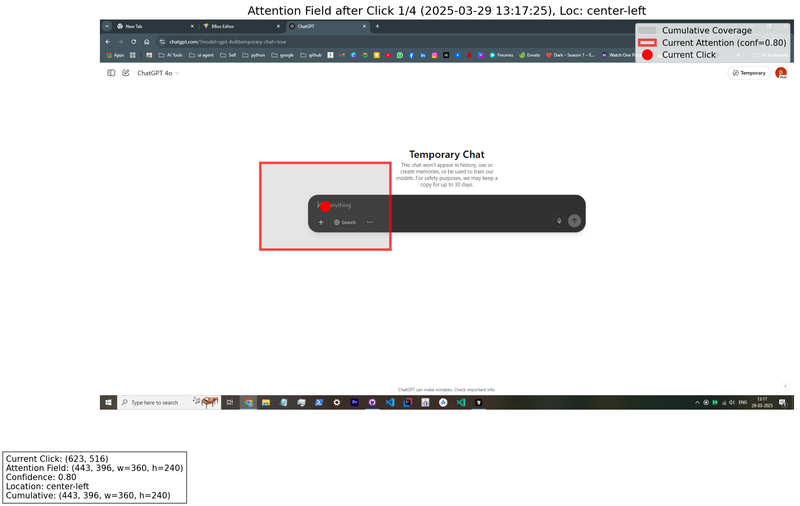

### Content Detection

The Content Detector identifies meaningful UI elements and text regions within the screen:

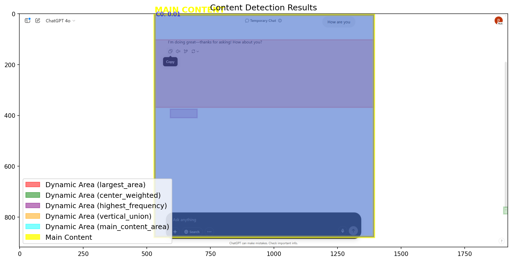

### Content Segmentation

The Content Segmentation module separates the UI into functional regions:

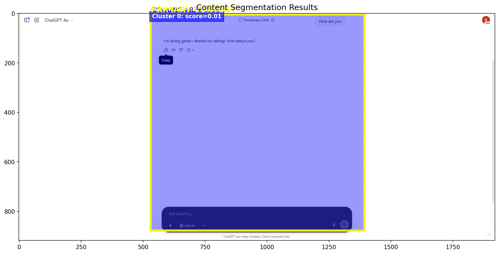

### Anchor-Based Main Area Detection

The system identifies key UI landmarks (anchors) that help pinpoint the main interaction area:

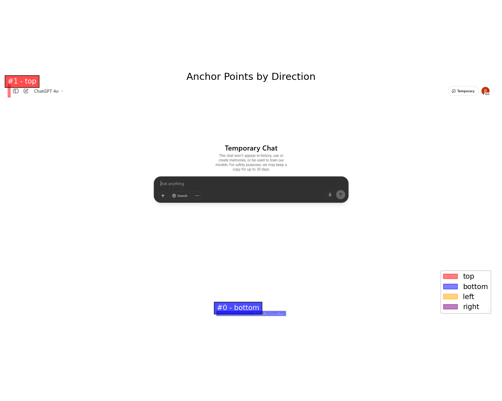

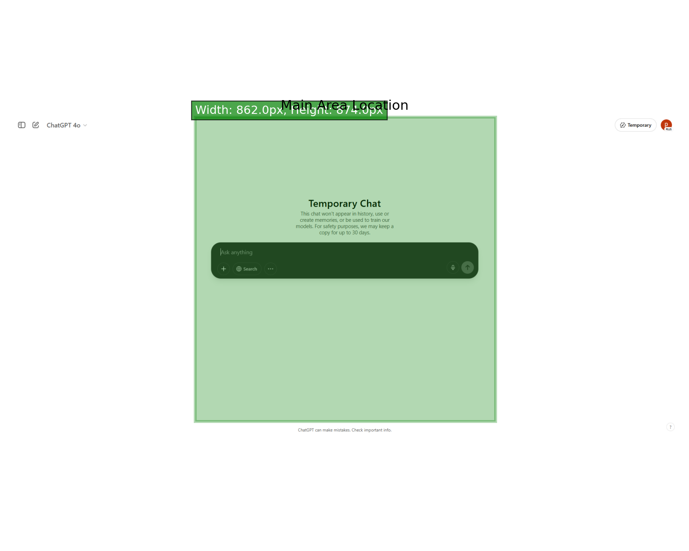

### Change Detection

The Image Diff Creator detects changes between UI states:

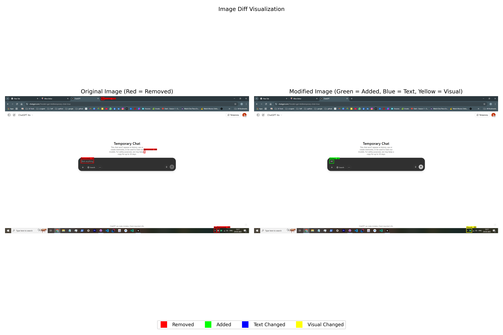

## Task Step Execution Visualization

The TaskLog system records and visualizes each step of task execution, providing detailed insights into how the system perceives and interacts with UI elements.

### TaskLog Structure

```python
@dataclass
class StepLog():
    step_id: int
    omni_image: str  # base64 encoded screenshot
    patch_image_path: str  # target template path
    match_result: PatchMatchResult  # matching outcome
    
class TaskLog():
    task_steps: List[StepLog]
```

### Step-by-Step Execution Examples

### 📊 Execution Visual Log: ChatGPT UI Automation

For each task step, the system generates a comprehensive visualization that includes:
- 📸 The full screen capture
- 🎯 The target template used for matching
- 🧠 The internal patch match decision (e.g., match score, heatmap location)

Below are examples from a real run of the `chatgpt_test.py` pipeline.

---

### 🔹 Step 1: Finding the Input Field

The system identifies the **“Ask anything”** input field to initiate interaction with ChatGPT:

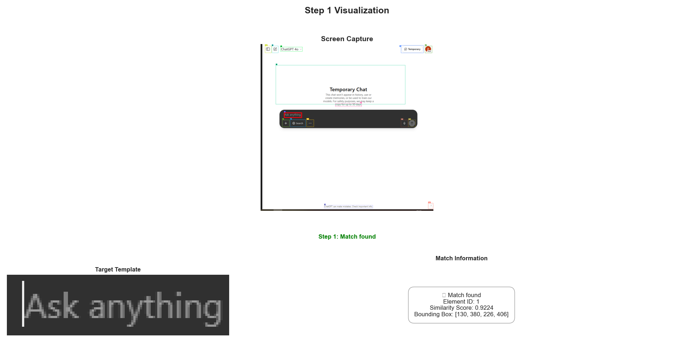

---

### 🔹 Step 4: Navigating UI Elements

After entering the prompt, the system monitors whether the **Send** button reappears (transitioning back from Stop):

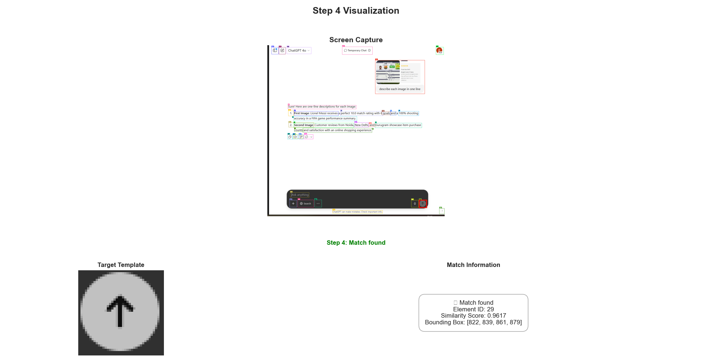

---

### 🔹 Step 7: Identifying Action Buttons

Once the response is complete, the system locates **action buttons** like **Copy** to extract the reply via clipboard:

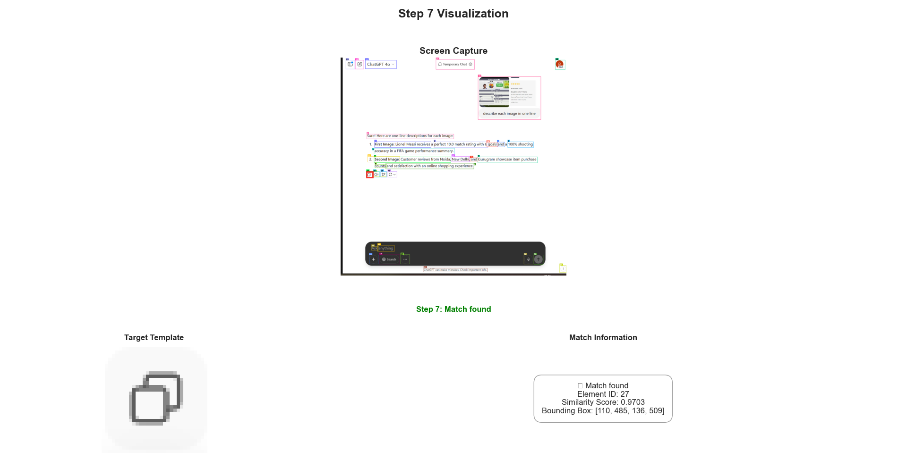

---

> 📁 *All visualizations are auto-generated and correspond to task schema checkpoints defined in memory-based UI automation.*


### Visualization Components

Each step visualization contains three key components:

1. **Screen Capture**: The current state of the UI with target matches highlighted
2. **Target Template**: The visual pattern being searched for
3. **Match Information**: Detailed data about the match including:
   - Element ID for the matched item
   - Similarity score (higher indicates better match)
   - Bounding box coordinates for the match location

### Match Result Details

For successful matches, the visualization displays:
- ✓ Match found indicator
- Element ID of the matched UI element
- Similarity score (higher is better)
- Bounding box coordinates [x, y, width, height]
- Red rectangle overlay on the screen capture showing match location

For unsuccessful matches:
- ❌ No match found indicator
- Error information if applicable

## Execution Flow

The execution flows from raw visual input to planned actions through these stages:

1. **Screenshot Capture** - The system captures the current screen state
2. **Visual Processing** - Multi-level feature extraction and element detection
3. **Target Identification** - Matching targets against detected elements
4. **Task Planning** - Determining the next steps based on task schema
5. **Action Execution** - Performing the appropriate mouse/keyboard actions

### Task Execution Sequence Example

For each action step, the system:

1. Captures the current screen
2. Processes it through the vision pipeline  
3. Identifies the target element
4. Executes the specified action

## Task Schema Structure

Tasks are defined using a structured schema that includes:

```python
class Task(BaseModel):
    task: str
    description: str
    app_name: str
    app_type: str
    app_url: str
    steps: List[Step]
```

Each step involves one of the following action types:
- Mouse actions (clicks, drags)
- Keyboard actions (typing, shortcuts)
- Wait actions (pause until element appears)

## Step Types and Actions

```python
class ActionType(str, Enum):
    MOUSE_ACTION = "mouse_action"
    KEYBOARD_ACTION = "keyboard_action"
    WAIT = "wait"

class MouseStep(StepWithTarget):
    action_type: ActionType = ActionType.MOUSE_ACTION
    keyboard_shortcut: Optional[str] = None
    
class KeyboardActionStep(Step):
    action_type: ActionType = ActionType.KEYBOARD_ACTION
    
class WaitStep(StepWithTarget):
    action_type: ActionType = ActionType.WAIT
```

Each step is visualized in the task log to provide a complete record of the execution process.

## Patch Matching Process

The visual element matching process compares target patches against screen elements:

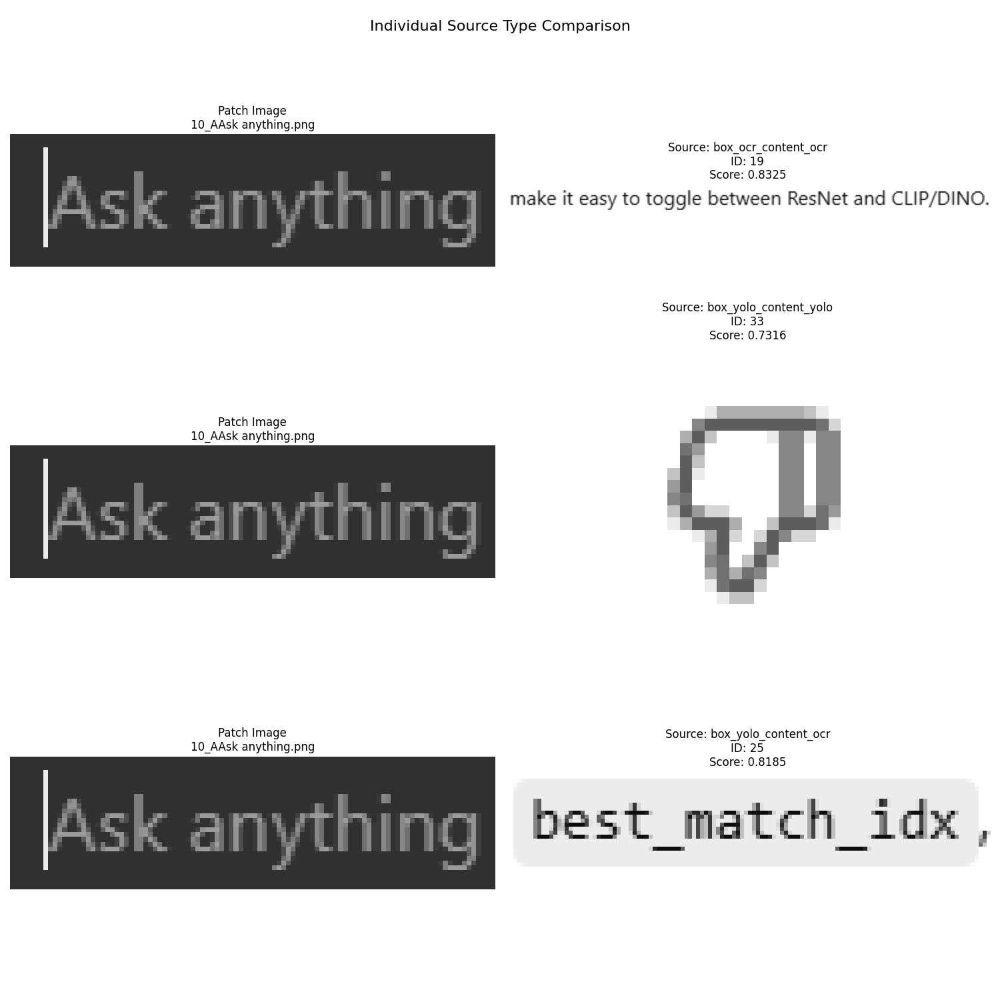

## Real-World Application Example

The system successfully automating a ChatGPT conversation:

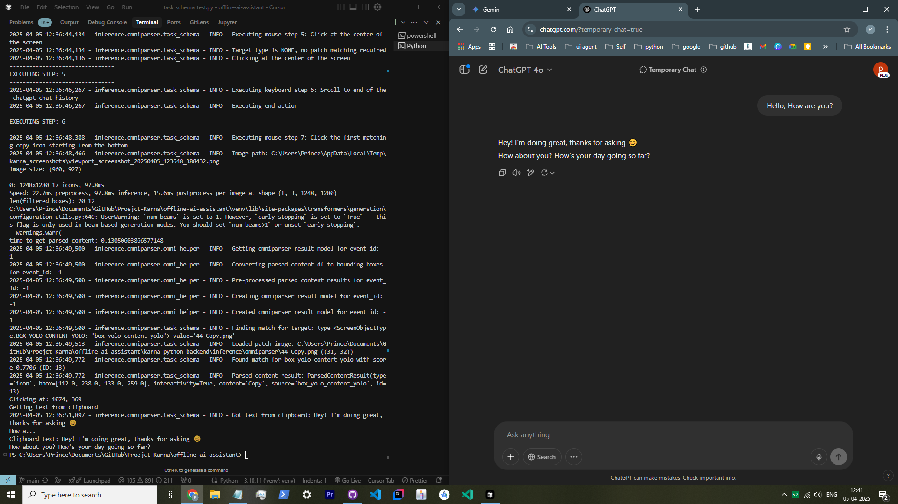

## Sequential Execution Success

Multiple interactions showing successful conversation automation:

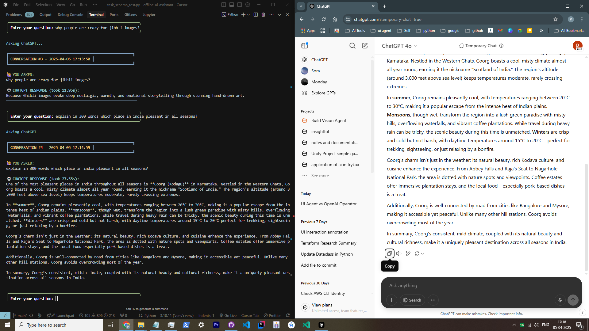

## Integration with System Components

The Execution Trace system integrates with multiple components across the Karna architecture to provide comprehensive insights into the system's operation.

### Component Interaction Flow

```
┌───────────────────────┐     ┌───────────────────────┐     ┌───────────────────────┐
│                       │     │                       │     │                       │
│     TaskExecutor      │────▶│      TaskPlanner      │────▶│      TaskSchema       │
│                       │     │                       │     │                       │
└───────────┬───────────┘     └───────────────────────┘     └───────────────────────┘
            │                           ▲
            │                           │
            ▼                           │
┌───────────────────────┐     ┌─────────┴─────────┐     ┌───────────────────────┐
│                       │     │                   │     │                       │
│     TaskLog System    │────▶│   VerticalPatch   │◀───▶│      Omniparser       │
│                       │     │      Matcher      │     │                       │
└───────────┬───────────┘     └───────────────────┘     └───────────────────────┘
            │                                                       ▲
            │                                                       │
            ▼                                                       │
┌───────────────────────┐     ┌───────────────────────┐     ┌───────┴───────────┐
│                       │     │                       │     │                   │
│   Execution Tracer    │────▶│  Attention Controller │────▶│  ChromeRobot      │
│                       │     │                       │     │                   │
└───────────────────────┘     └───────────────────────┘     └───────────────────┘
```

### Data Flow in Execution Tracing

1. **TaskExecutor** initiates the process by preparing the execution environment
2. **TaskLog** maintains a record of each step's execution status
3. **Omniparser** processes screen captures to extract visual elements
4. **VerticalPatchMatcher** identifies target elements on the screen
5. **ChromeRobot** performs the actual mouse and keyboard interactions
6. **AttentionController** directs the visual focus across the UI

### Cross-Component Metrics Tracking

The execution trace system captures metrics from multiple components:

| Component | Metrics Tracked |
|-----------|----------------|
| Omniparser | Element detection count, OCR confidence scores |
| PatchMatcher | Similarity scores, match positions |
| TaskExecutor | Action success rate, execution time per step |
| AttentionController | Attention field coverage, focus shifts |
| ChromeRobot | Input latency, action completion times |

### Visualization Orchestration

The TaskLog's `visualize_task_log()` method orchestrates the creation of comprehensive visualizations by:

1. Processing base64-encoded screenshots from each execution step
2. Loading and rendering template patch images
3. Computing match overlays using bounding box information
4. Constructing multi-panel visualizations using matplotlib
5. Organizing visual data in a consistent, human-interpretable format

### Integration with External Tools

The execution trace visualization can be exported in multiple formats:

1. **Interactive Jupyter notebooks** for detailed analysis
2. **Static markdown documents** for documentation
3. **HTML reports** for sharing with non-technical stakeholders
4. **PNG image collections** for presentations

## Benefits of This Architecture

1. **Universal Application Compatibility** - Works with any visual UI without requiring APIs
2. **Resilience to UI Changes** - Identifies elements through visual appearance and context
3. **Application Boundary Crossing** - Seamlessly automates workflows spanning multiple applications
4. **Human-inspired Interaction** - Mimics perception-based input instead of relying on internal application APIs
5. **Debugging and Explainability** - The system's "thought process" can be visualized

## Visualization Metrics

The system tracks performance metrics including:
- Similarity scores for matched elements
- Processing time for each component
- Action success rate
- Visual accuracy measurements

This biomimetic approach represents a significant advancement in UI automation, bridging the gap between how computers and humans perceive interfaces.
