# Karna Cortex Vision: Execution Flow Visualization

This document visualizes the execution flow and component interaction of the Karna Cortex Vision module, which simulates human-like visual perception for UI automation.

## System Architecture Overview

The Karna Cortex Vision system is conceptualised as a biomimetic architecture that mirrors the human visual cortex, with hierarchical processing layers that transform raw visual input into structured perception and goal-directed actions.

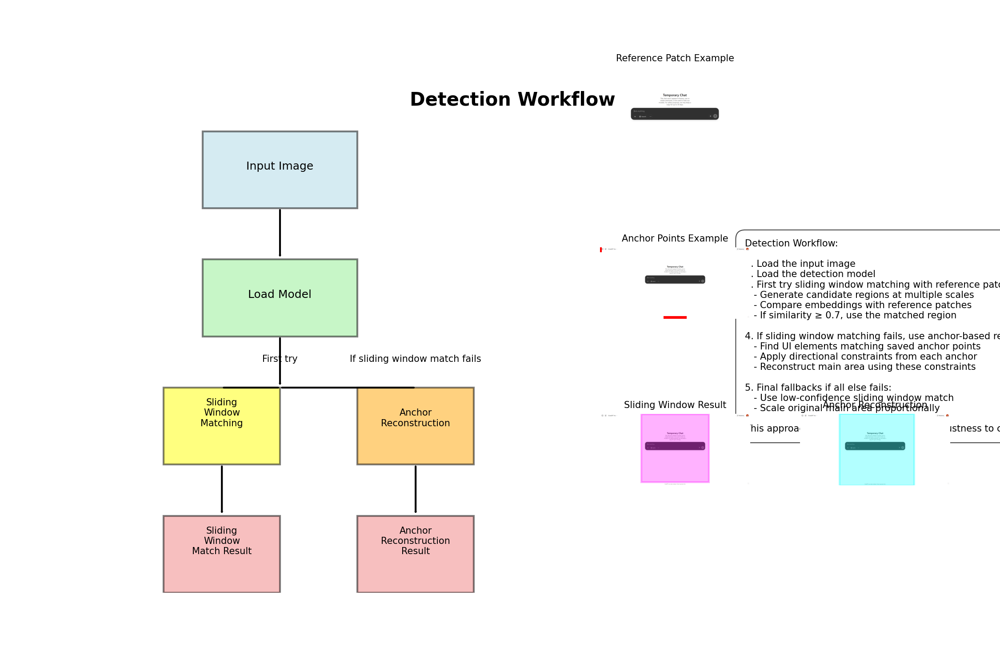

## Neuroscience-Inspired Hierarchical Processing

The system's architecture maps to the biological visual cortex, with specialized components for each level of processing:

```
Visual Cortex Hierarchy and System Mapping
------------------------------------------

1. Primary Visual Processing (V1/V2)
   - Omniparser: OCR Engine, YOLO Models, ResNet Embeddings

2. Visual Feature Detection (V2/V3)
   - Image Comparison
   - Content Detection
   - Pattern Matching

3. Pattern Recognition (V4/IT)
   - Vertical Patch Matcher
   - Anchor-based Detection

4. Motion Processing (MT/V5)
   - Dynamic Area Detection
   - Image Diff Creator
   - UI Dynamic Detection

5. Spatial Attention (Parietal)
   - Attention Controller
   - Extended Attention

6. Object Categorization (Inferotemporal)
   - Clustering
   - Omni Helper

7. Working Memory (Prefrontal)
   - Task Schema
   - Task Generator

8. Executive Planning (Frontal)
   - Task Planning
   - Task Planner

9. Action Execution (Motor Cortex)
   - Task Executor
   - Clipboard Utils

10. Multimodal Integration (Association Areas)
    - System Integration
    - Task Structures
```

## Visual Processing Components

### Attention Fields

The Attention Controller simulates human-like gaze focus, directing computational resources to the most relevant areas of the screen.


### Content Detection

The Content Detector identifies meaningful UI elements and text regions within the screen:

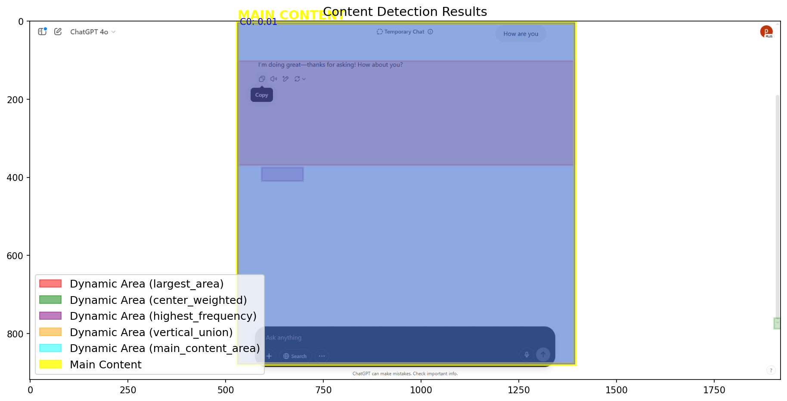

### Content Segmentation

The Content Segmentation module separates the UI into functional regions:

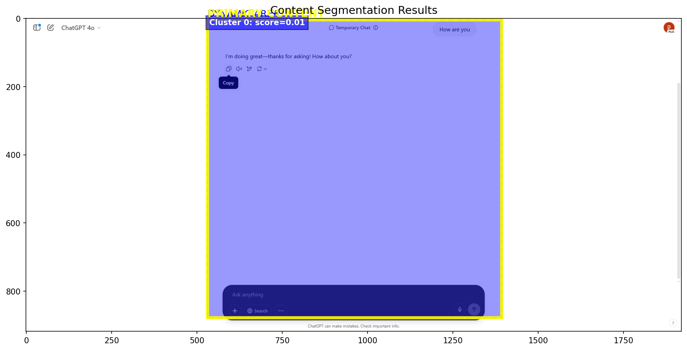

### Anchor-Based Main Area Detection

The system identifies key UI landmarks (anchors) that help pinpoint the main interaction area:

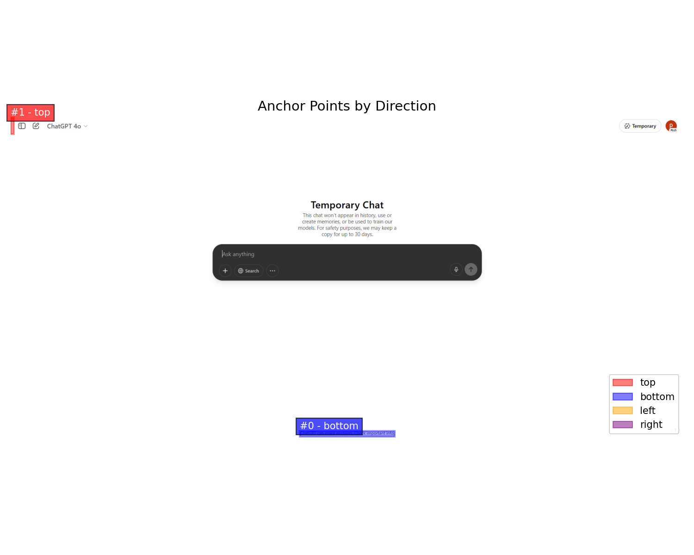

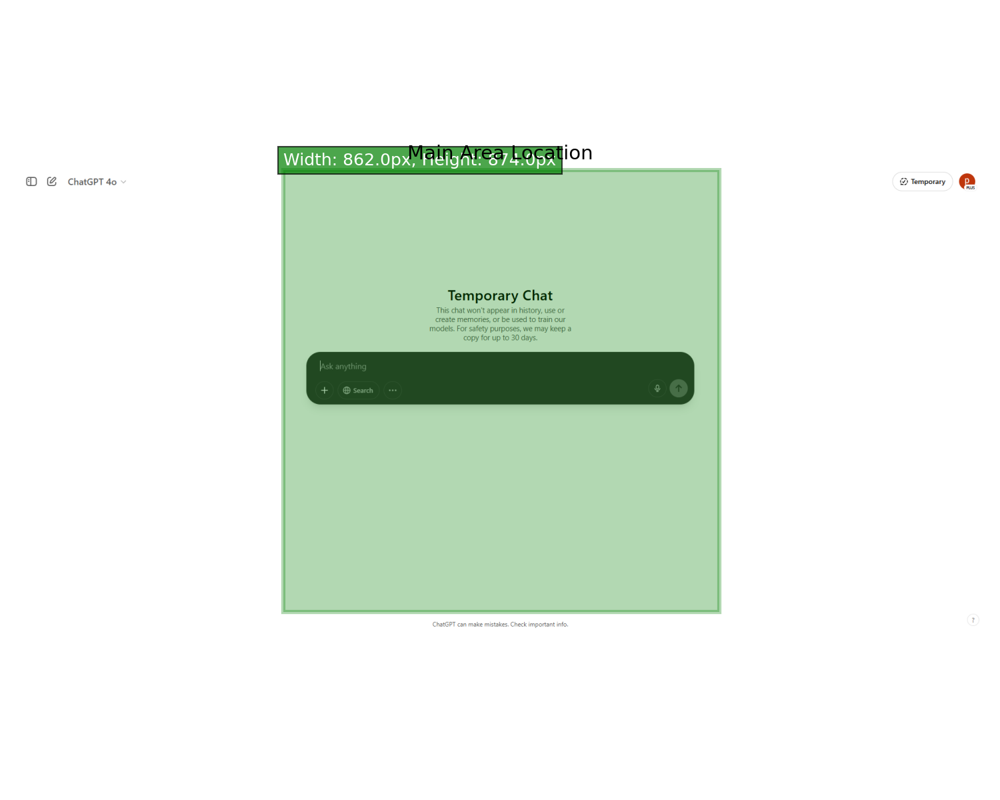

### Change Detection

The Image Diff Creator detects changes between UI states:

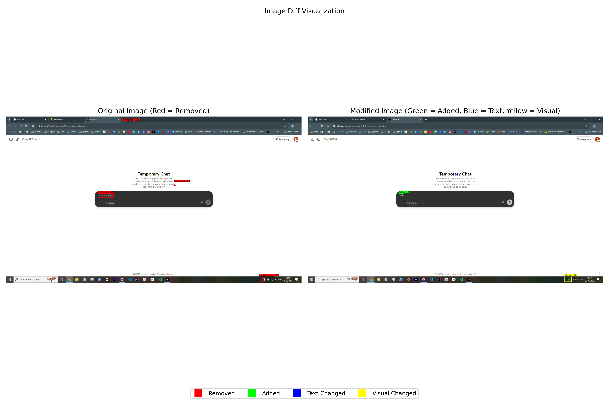

## Task Step Execution Visualization

The TaskLog system records and visualizes each step of task execution, providing detailed insights into how the system perceives and interacts with UI elements.

### TaskLog Structure

```python
@dataclass
class StepLog():
    step_id: int
    omni_image: str  # base64 encoded screenshot
    patch_image_path: str  # target template path
    match_result: PatchMatchResult  # matching outcome
    
class TaskLog():
    task_steps: List[StepLog]
```

### Step-by-Step Execution Examples

### 📊 Execution Visual Log: ChatGPT UI Automation

For each task step, the system generates a comprehensive visualization that includes:
- 📸 The full screen capture
- 🎯 The target template used for matching
- 🧠 The internal patch match decision (e.g., match score, heatmap location)

Below are examples from a real run of the `chatgpt_test.py` pipeline.

---

### 🔹 Step 1: Finding the Input Field

The system identifies the **“Ask anything”** input field to initiate interaction with ChatGPT:


---

### 🔹 Step 4: Navigating UI Elements

After entering the prompt, the system monitors whether the **Send** button reappears (transitioning back from Stop):

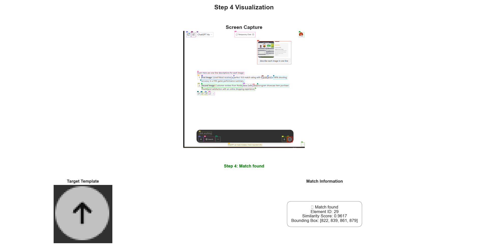

---

### 🔹 Step 7: Identifying Action Buttons

Once the response is complete, the system locates **action buttons** like **Copy** to extract the reply via clipboard:

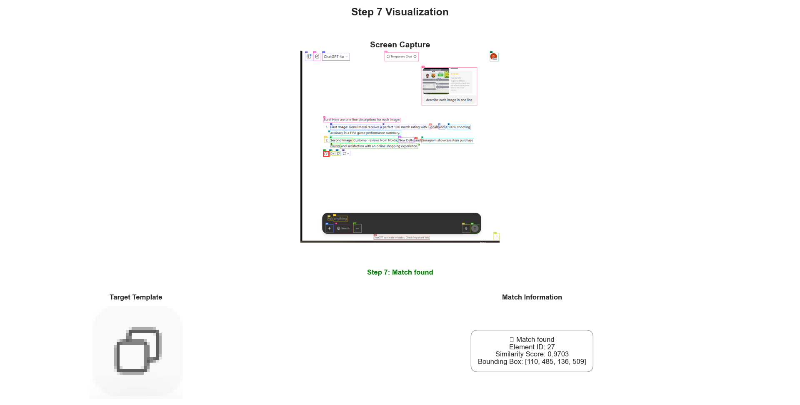

---

> 📁 *All visualizations are auto-generated and correspond to task schema checkpoints defined in memory-based UI automation.*


### Visualization Components

Each step visualization contains three key components:

1. **Screen Capture**: The current state of the UI with target matches highlighted
2. **Target Template**: The visual pattern being searched for
3. **Match Information**: Detailed data about the match including:
   - Element ID for the matched item
   - Similarity score (higher indicates better match)
   - Bounding box coordinates for the match location

### Match Result Details

For successful matches, the visualization displays:
- ✓ Match found indicator
- Element ID of the matched UI element
- Similarity score (higher is better)
- Bounding box coordinates [x, y, width, height]
- Red rectangle overlay on the screen capture showing match location

For unsuccessful matches:
- ❌ No match found indicator
- Error information if applicable

## Execution Flow

The execution flows from raw visual input to planned actions through these stages:

1. **Screenshot Capture** - The system captures the current screen state
2. **Visual Processing** - Multi-level feature extraction and element detection
3. **Target Identification** - Matching targets against detected elements
4. **Task Planning** - Determining the next steps based on task schema
5. **Action Execution** - Performing the appropriate mouse/keyboard actions

### Task Execution Sequence Example

For each action step, the system:

1. Captures the current screen
2. Processes it through the vision pipeline  
3. Identifies the target element
4. Executes the specified action

## Task Schema Structure

Tasks are defined using a structured schema that includes:

```python
class Task(BaseModel):
    task: str
    description: str
    app_name: str
    app_type: str
    app_url: str
    steps: List[Step]
```

Each step involves one of the following action types:
- Mouse actions (clicks, drags)
- Keyboard actions (typing, shortcuts)
- Wait actions (pause until element appears)

## Step Types and Actions

```python
class ActionType(str, Enum):
    MOUSE_ACTION = "mouse_action"
    KEYBOARD_ACTION = "keyboard_action"
    WAIT = "wait"

class MouseStep(StepWithTarget):
    action_type: ActionType = ActionType.MOUSE_ACTION
    keyboard_shortcut: Optional[str] = None
    
class KeyboardActionStep(Step):
    action_type: ActionType = ActionType.KEYBOARD_ACTION
    
class WaitStep(StepWithTarget):
    action_type: ActionType = ActionType.WAIT
```

Each step is visualized in the task log to provide a complete record of the execution process.

## Patch Matching Process

The visual element matching process compares target patches against screen elements:

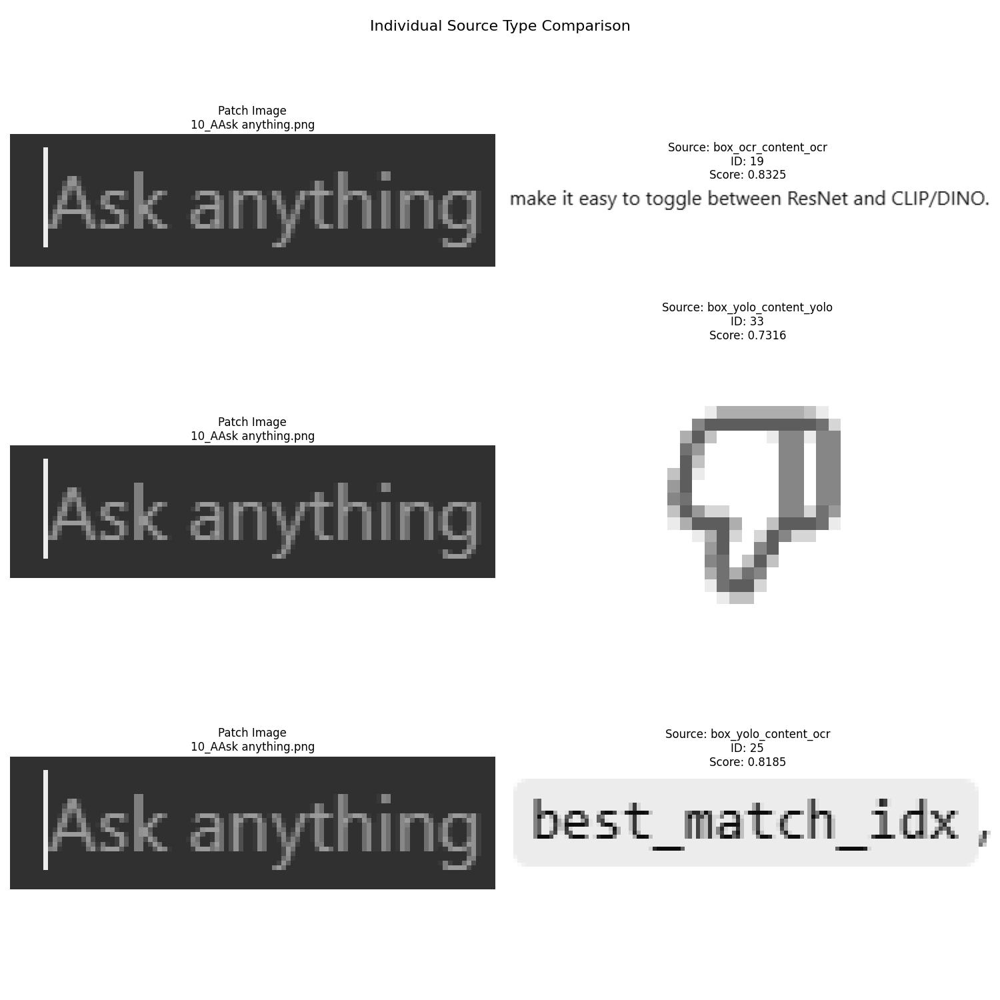

## Real-World Application Example

The system successfully automating a ChatGPT conversation:

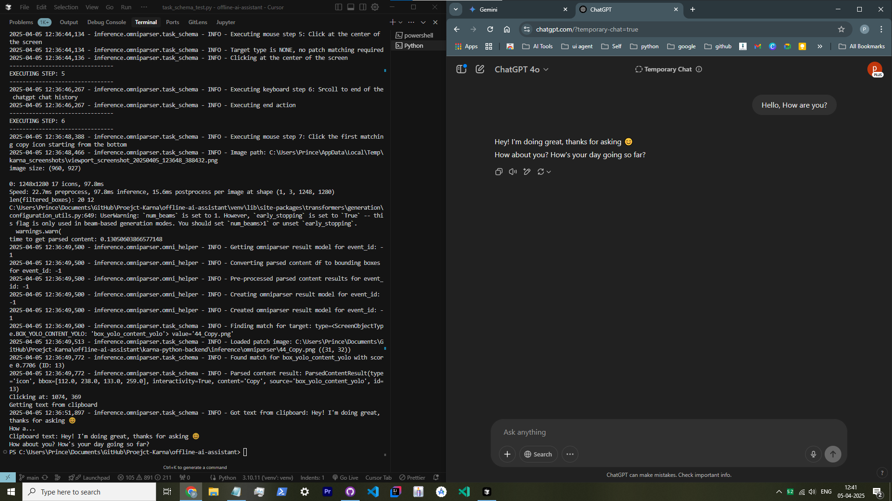

## Sequential Execution Success

Multiple interactions showing successful conversation automation:

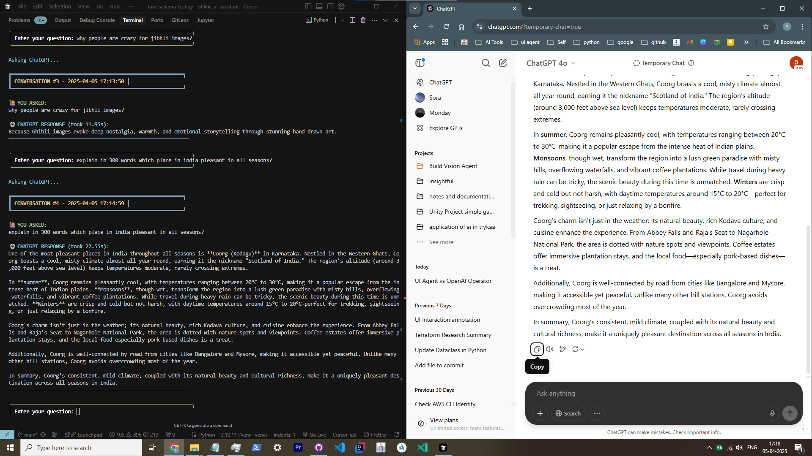

## Integration with System Components

The Execution Trace system integrates with multiple components across the Karna architecture to provide comprehensive insights into the system's operation.

### Component Interaction Flow

```
┌───────────────────────┐     ┌───────────────────────┐     ┌───────────────────────┐
│                       │     │                       │     │                       │
│     TaskExecutor      │────▶│      TaskPlanner      │────▶│      TaskSchema       │
│                       │     │                       │     │                       │
└───────────┬───────────┘     └───────────────────────┘     └───────────────────────┘
            │                           ▲
            │                           │
            ▼                           │
┌───────────────────────┐     ┌─────────┴─────────┐     ┌───────────────────────┐
│                       │     │                   │     │                       │
│     TaskLog System    │────▶│   VerticalPatch   │◀───▶│      Omniparser       │
│                       │     │      Matcher      │     │                       │
└───────────┬───────────┘     └───────────────────┘     └───────────────────────┘
            │                                                       ▲
            │                                                       │
            ▼                                                       │
┌───────────────────────┐     ┌───────────────────────┐     ┌───────┴───────────┐
│                       │     │                       │     │                   │
│   Execution Tracer    │────▶│  Attention Controller │────▶│  ChromeRobot      │
│                       │     │                       │     │                   │
└───────────────────────┘     └───────────────────────┘     └───────────────────┘
```

### Data Flow in Execution Tracing

1. **TaskExecutor** initiates the process by preparing the execution environment
2. **TaskLog** maintains a record of each step's execution status
3. **Omniparser** processes screen captures to extract visual elements
4. **VerticalPatchMatcher** identifies target elements on the screen
5. **ChromeRobot** performs the actual mouse and keyboard interactions
6. **AttentionController** directs the visual focus across the UI

### Cross-Component Metrics Tracking

The execution trace system captures metrics from multiple components:

| Component | Metrics Tracked |
|-----------|----------------|
| Omniparser | Element detection count, OCR confidence scores |
| PatchMatcher | Similarity scores, match positions |
| TaskExecutor | Action success rate, execution time per step |
| AttentionController | Attention field coverage, focus shifts |
| ChromeRobot | Input latency, action completion times |

### Visualization Orchestration

The TaskLog's `visualize_task_log()` method orchestrates the creation of comprehensive visualizations by:

1. Processing base64-encoded screenshots from each execution step
2. Loading and rendering template patch images
3. Computing match overlays using bounding box information
4. Constructing multi-panel visualizations using matplotlib
5. Organizing visual data in a consistent, human-interpretable format

### Integration with External Tools

The execution trace visualization can be exported in multiple formats:

1. **Interactive Jupyter notebooks** for detailed analysis
2. **Static markdown documents** for documentation
3. **HTML reports** for sharing with non-technical stakeholders
4. **PNG image collections** for presentations

## Benefits of This Architecture

1. **Universal Application Compatibility** - Works with any visual UI without requiring APIs
2. **Resilience to UI Changes** - Identifies elements through visual appearance and context
3. **Application Boundary Crossing** - Seamlessly automates workflows spanning multiple applications
4. **Human-like Interaction** - Operates through visual perception rather than direct element access
5. **Debugging and Explainability** - The system's "thought process" can be visualized

## Visualization Metrics

The system tracks performance metrics including:
- Similarity scores for matched elements
- Processing time for each component
- Action success rate
- Visual accuracy measurements

This biomimetic approach represents a significant advancement in UI automation, bridging the gap between how computers and humans perceive interfaces.
