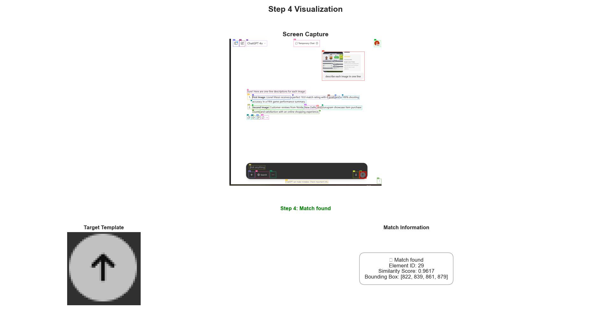
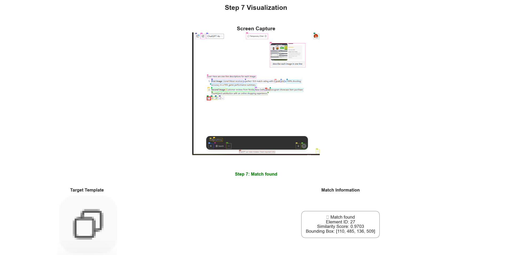

# 📊 Execution Visual Log: ChatGPT UI Automation
## Task Step Execution Visualization

The TaskLog system records and visualizes each step of task execution, providing detailed insights into how the system perceives and interacts with UI elements.

### Step-by-Step Execution Examples

For each task step, the system generates a comprehensive visualization that includes:
- 📸 The full screen capture
- 🎯 The target template used for matching
- 🧠 The internal patch match decision (e.g., match score, heatmap location)

Below are examples from a real run of the `chatgpt_test.py` pipeline.

---

### 🔹 Step 1: Finding the Input Field

The system identifies the **“Ask anything”** input field to initiate interaction with ChatGPT:


---

### 🔹 Step 4: Navigating UI Elements

After entering the prompt, the system monitors whether the **Send** button reappears (transitioning back from Stop):



---

### 🔹 Step 7: Identifying Action Buttons

Once the response is complete, the system locates **action buttons** like **Copy** to extract the reply via clipboard:



---

> 📁 *All visualizations are auto-generated and correspond to task schema checkpoints defined in memory-based UI automation.*


### Visualization Components

Each step visualization contains three key components:

1. **Screen Capture**: The current state of the UI with target matches highlighted
2. **Target Template**: The visual pattern being searched for
3. **Match Information**: Detailed data about the match including:
   - Element ID for the matched item
   - Similarity score (higher indicates better match)
   - Bounding box coordinates for the match location

### Match Result Details

For successful matches, the visualization displays:
- ✓ Match found indicator
- Element ID of the matched UI element
- Similarity score (higher is better)
- Bounding box coordinates [x, y, width, height]
- Red rectangle overlay on the screen capture showing match location

For unsuccessful matches:
- ❌ No match found indicator
- Error information if applicable

## Execution Flow

The execution flows from raw visual input to planned actions through these stages:

1. **Screenshot Capture** - The system captures the current screen state
2. **Visual Processing** - Multi-level feature extraction and element detection
3. **Target Identification** - Matching targets against detected elements
4. **Task Planning** - Determining the next steps based on task schema
5. **Action Execution** - Performing the appropriate mouse/keyboard actions

### Task Execution Sequence Example

For each action step, the system:

1. Captures the current screen
2. Processes it through the vision pipeline  
3. Identifies the target element
4. Executes the specified action

## Task Schema Structure

Tasks are defined using a structured schema that includes:

```python
class Task(BaseModel):
    task: str
    description: str
    app_name: str
    app_type: str
    app_url: str
    steps: List[Step]
```

Each step involves one of the following action types:
- Mouse actions (clicks, drags)
- Keyboard actions (typing, shortcuts)
- Wait actions (pause until element appears)
